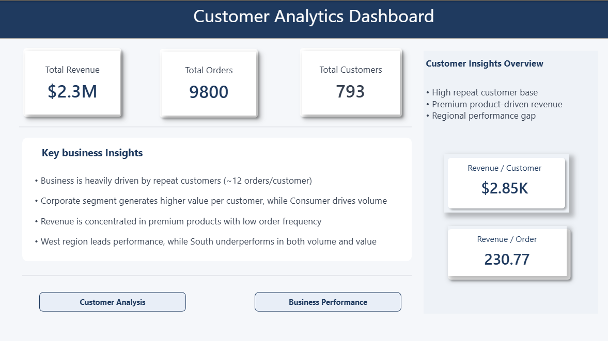
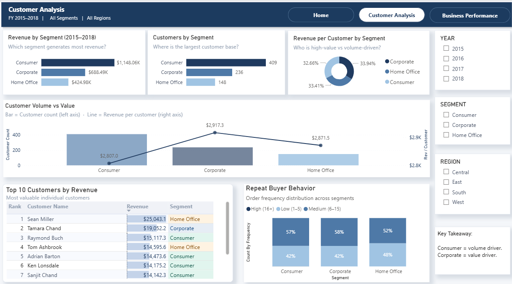
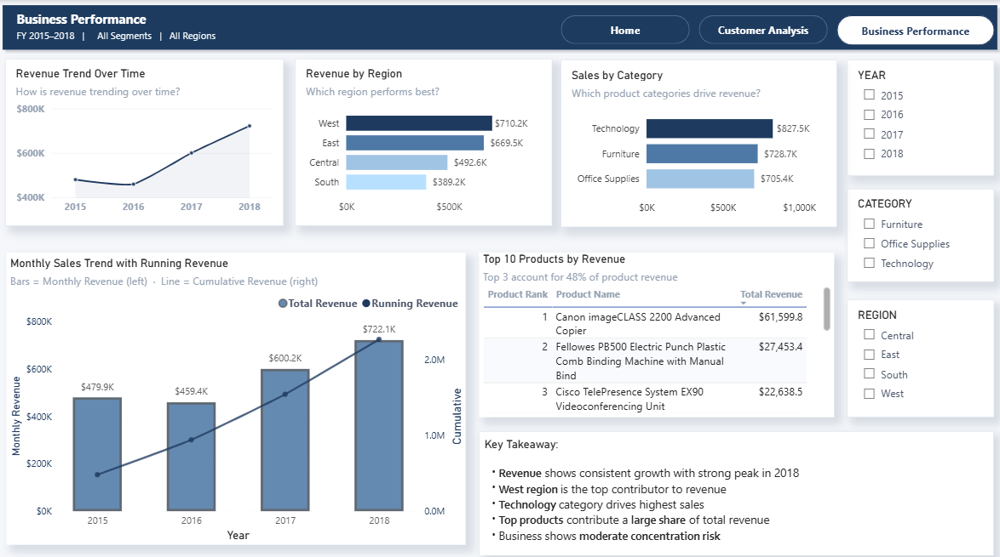

# Customer Analytics Dashboard (Power BI + SQL)

## 📊 Project Overview
This project analyzes customer behavior, revenue performance, and business trends using a retail dataset (~9,800 records). The goal was to transform raw data into actionable business insights.

## 🛠 Tools & Technologies
- SQL Server – Data cleaning & transformation  
- Power BI – Data modeling & visualization  
- DAX – KPI calculations and business logic  

## 🔧 Key Steps
- Cleaned raw data (handled missing values, duplicates, and data types)
- Built a star schema data model (Fact + Dimension tables)
- Created DAX measures (Total Revenue, Orders, Customers, Running Revenue, etc.)
- Designed a 3-page interactive dashboard

## 📈 Key Insights
- Consumer segment drives volume, while Corporate generates higher value per customer  
- Repeat customers significantly contribute to total revenue  
- West region leads performance, while South underperforms  
- Revenue is concentrated in high-value products and categories  

## 📊 Dashboard Pages
1. **Home (Overview)** – KPI summary and key insights  
2. **Customer Analysis** – Segment performance and repeat buyer behavior  
3. **Business Performance** – Revenue trends, region, and category analysis  

## 📂 Files Included
- Customer_Analytics.pbix  
- Dashboard screenshots  

## 🚀 Outcome
This project demonstrates an end-to-end analytics workflow — from SQL-based data preparation to Power BI dashboard development and business storytelling.

## 📸 Dashboard Preview

### 🏠 Home Page

### 👥 Customer Analysis

### 📊 Business Performance

